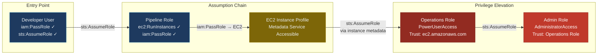
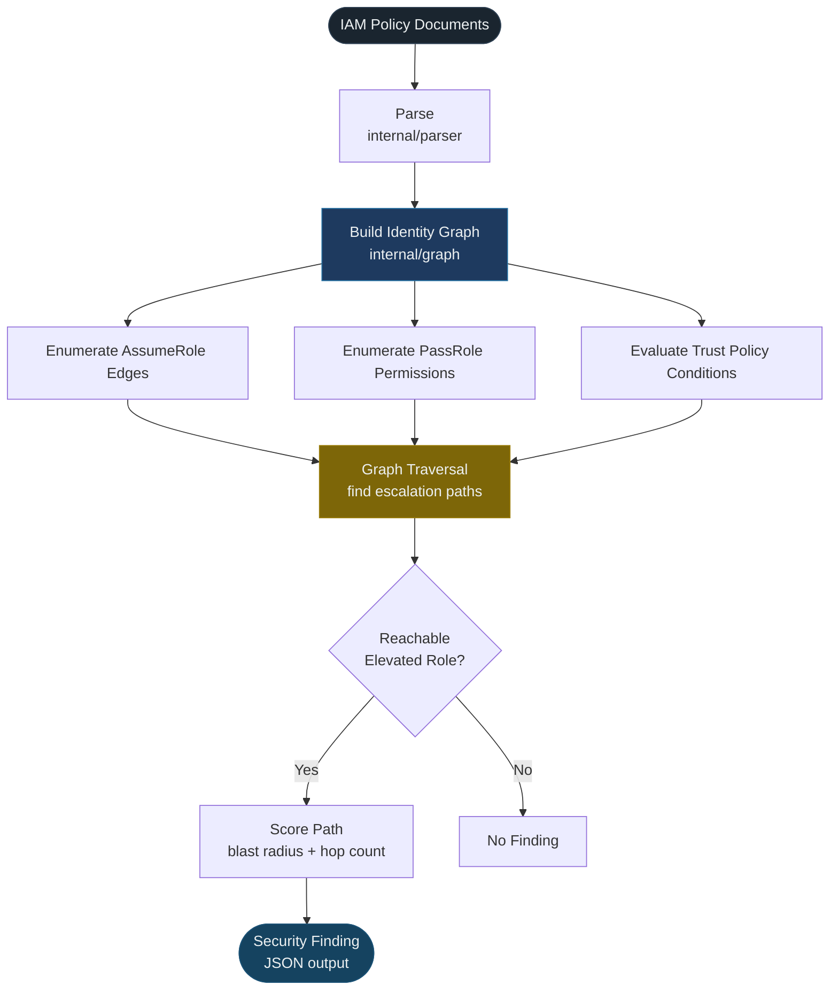
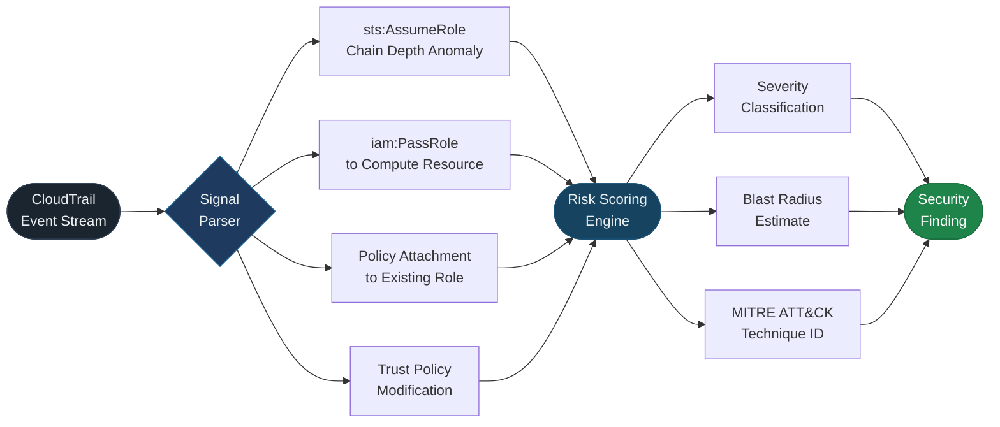

<<<<<<< HEAD
Cloud Identity Security Engineering

«IAM permissions are not a list. They are a graph.»

Cloud Identity Security Engineering is a practitioner-focused research project exploring how AWS Identity and Access Management (IAM) configurations can be modeled as authorization graphs to identify privilege escalation, lateral movement, and identity-based attack paths.

Instead of inspecting IAM policies in isolation, this project builds tooling that discovers relationships across policies, trust boundaries, service roles, and cross-account assumptions.

The repository accompanies the Cloud Identity Security Engineering Hashnode series, where each article introduces a new security engineering capability backed by working Go implementations, threat modeling, attack-path analysis, and detection engineering.

---

Core Philosophy

Modern cloud environments are composed of interconnected identities rather than isolated permissions.

A single IAM policy may appear harmless on its own. However, when combined with trust relationships, resource policies, delegated permissions, and service roles, it can become part of a multi-stage privilege escalation path.

The objective of this project is to model those relationships explicitly.

Rather than asking:

«"Does this policy look dangerous?"»

this project asks:

«"What can this identity eventually become?"»

That shift—from policy inspection to graph traversal—forms the foundation of this repository.

---

Project Objectives

The objective of this repository is to build tooling for:

- Parsing AWS IAM and trust policies.
- Constructing authorization graphs.
- Modeling cross-account role assumption paths.
- Identifying privilege escalation opportunities.
- Detecting identity-based attack paths.
- Engineering CloudTrail detections from observable behavior.
- Mapping findings to MITRE ATT&CK and common compliance frameworks.

---

Repository Structure

.
├── analysis/
│   └── rr-001/
=======
<div align="center">

# Cloud Identity Security Engineering

**AWS IAM Threat Modeling · Privilege Escalation Analysis · Detection Engineering · Go**

<br/>

[](go.mod)
[](LICENSE)
[](/.github/workflows/test.yml)
[](https://goreportcard.com/report/github.com/[handle]/cloud-identity-security-engineering)
[](https://hashnode.com/@[handle]/series/cloud-identity-security-engineering)

<br/>

</div>

> **IAM permissions are not a list. They are a graph.**
>
> Privilege escalation paths, lateral movement opportunities, and trust relationship abuse scenarios are not visible when you examine policies in isolation. They emerge only when you traverse the edges — when you model what an identity can *become* through a chain of individually authorized API calls.

---

## Navigation

| Section | |
|---------|--|
| [Problem Statement](#problem-statement) | Why list-based IAM analysis fails |
| [IAM as an Authorization Graph](#iam-as-an-authorization-graph) | The core modeling approach with diagram |
| [Privilege Escalation Modeling](#privilege-escalation-modeling) | Attack path analysis with flow diagram |
| [Architecture](#architecture) | Package design and dependency diagram |
| [Detection Engineering](#detection-engineering) | CloudTrail signal pipeline diagram |
| [Repository Structure](#repository-structure) | Codebase layout |
| [Implementation Status](#implementation-status) | What is built vs. planned |
| [Research Series](#research-series) | Published analysis entries |
| [MITRE ATT&CK Coverage](#mitre-attck-coverage) | Technique mapping |
| [Getting Started](#getting-started) | Build and run |
| [Roadmap](#roadmap) | Near-term engineering priorities |

---

## Problem Statement

AWS IAM is one of the most expressive authorization systems in any public cloud. It supports identity-based policies, resource-based policies, trust policies, permission boundaries, and service control policies — each with its own evaluation order, override semantics, and interaction surface.

That expressiveness is the structural vulnerability.

IAM configurations in production environments are not designed — they accumulate. Policies are attached because a service needed access. Roles are created because a deadline was approaching. Trust relationships are extended because a vendor requested it. Each change is reviewed in isolation. No one reviews the graph.

The result, over time, is a permission graph with traversable paths that no one intended to create. A developer identity with `iam:PassRole` can reach an EC2 instance profile that can assume an operations role with `PowerUserAccess`. A pipeline role with an unconstrained trust principal becomes an unintended escalation pivot. A cross-account trust with a wildcard condition creates lateral movement paths from a compromised third-party account.

These paths are not visible when you audit policies as a list. They are only visible when you model IAM as what it actually is: a directed graph of authorization edges.

**This project builds the tooling to make that graph visible.**

---

## IAM as an Authorization Graph

Standard IAM auditing tools evaluate policies in isolation — they answer *"what does this policy allow?"* This project answers a different question: **what can this identity reach through any path in the authorization graph?**



Each hop is individually authorized. No single policy is obviously misconfigured. The risk is visible only at the path level.

**Graph nodes** represent IAM principals, AWS services acting as principals, and target resources. **Graph edges** represent permission grants (`iam:PassRole`, policy attachment), trust relationships (`sts:AssumeRole`), and resource-based policy grants. **Graph traversal** finds paths from any starting identity to any elevated destination — regardless of the number of intermediate hops.

---

## Privilege Escalation Modeling

Privilege escalation is modeled as a reachability problem on the authorization graph. The key patterns targeted:

| Pattern | Mechanism | Typical Blast Radius |
|---------|-----------|---------------------|
| `iam:PassRole` to compute | Assign a high-privilege role to an EC2/Lambda resource you control | Principal → Admin |
| Policy attachment | `iam:AttachRolePolicy` — attach AWS-managed admin policy to existing role | Any role → Admin |
| Trust policy modification | `iam:UpdateAssumeRolePolicy` — add self to trust policy of privileged role | Current identity → Target role |
| Role chain depth | Multi-hop `sts:AssumeRole` to reach roles beyond direct assumption | Depends on chain depth |
| Wildcard trust principal | `"Principal": "*"` or unconstrained `aws:PrincipalOrgID` condition | Org-wide or public |



---

## Architecture

The project is organized around a dependency-free domain model (`internal/model`) that the parser, graph, attack, and detection packages build upon independently. CLI entry points in `cmd/` compose these packages without coupling them to each other.

```mermaid
graph TD
    subgraph CLI["cmd/"]
        pp["policyparser\nParse + validate policy documents"]
        sc["iamscan\nScan config against detection rules"]
        ap["attackpath\nBuild graph, enumerate escalation paths"]
    end

    subgraph Core["internal/"]
        model["model\nIdentity · Permission · Event\nCore domain types — no external deps"]
        parser["parser\nAWS policy parser\nTrust policy parser"]
        iam["iam\nPolicy evaluation\nAction namespace resolution"]
        graph["graph\nIdentity graph\nTraversal  ≤ 300 LOC hard cap"]
        attack["attack\nEscalation path rules\nBlast radius scoring"]
        detection["detection\nCloudTrail signal parser\nDetection rule engine"]
    end

    pp --> parser
    sc --> detection
    ap --> attack

    parser --> model
    iam    --> model
    model  --> graph
    graph  --> attack
    attack --> detection

    style model     fill:#1a252f,color:#ecf0f1,stroke:#2c3e50
    style graph     fill:#1e3a5f,color:#ecf0f1,stroke:#2471a3
    style attack    fill:#922b21,color:#fff,stroke:#7b241c
    style detection fill:#154360,color:#ecf0f1,stroke:#1a5276
```

The `internal/graph` package is subject to a hard line-of-code cap of 300 lines across `identity_graph.go` and `traversal.go`. Graph traversal logic complex enough to require more than 300 lines is complex enough to hide bugs.

---

## Detection Engineering

Detection is grounded in CloudTrail — the authoritative record of IAM control plane activity. The detection pipeline consumes CloudTrail event streams, correlates observed behavior against escalation paths discovered during graph analysis, and generates findings with MITRE ATT&CK mappings.



Detection rules are not signature-based. They are derived from the graph model — a rule fires when observed CloudTrail behavior matches a traversal path identified as an escalation route during static analysis. Detection coverage improves as graph coverage improves.

---

## Repository Structure

<details>
<summary><strong>Expand full tree</strong></summary>

```
cloud-identity-security-engineering/
│
├── cmd/
│   ├── attackpath/
│   │   └── main.go              # CLI: build graph, enumerate escalation paths
│   ├── iamscan/
│   │   └── main.go              # CLI: scan IAM config against detection rules
│   └── policyparser/
│       └── main.go              # CLI: parse and validate policy documents
│
├── internal/
│   ├── attack/
│   │   ├── attack_rules.go      # Escalation pattern definitions
│   │   └── escalation_paths.go  # Graph traversal for path discovery
│   ├── detection/
│   │   ├── cloudtrail_signals.go # Event parsing and correlation
│   │   └── detection_rules.go    # Detection rule definitions
│   ├── graph/
│   │   ├── identity_graph.go    # Graph construction  (hard cap: ≤300 LOC total)
│   │   └── traversal.go         # BFS/DFS traversal, path enumeration
│   ├── iam/
│   │   ├── actions.go           # IAM action namespace resolution
│   │   ├── policy.go            # Identity policy evaluation logic
│   │   └── trust.go             # Trust policy parsing and condition evaluation
│   ├── model/
│   │   ├── event.go             # CloudTrail event domain type
│   │   ├── identity.go          # IAM principal domain type
│   │   └── permission.go        # Permission and policy domain types
│   └── parser/
│       ├── aws_policy_parser.go   # AWS IAM JSON policy parser
│       └── trust_policy_parser.go # Trust policy parser with condition handling
│
├── examples/
│   ├── attack-scenarios/          # Documented exploitation scenarios (Markdown)
│   ├── cloudtrail-logs/           # Sample CloudTrail events for detection testing
│   ├── compliance-reports/        # ISO 27001 / SOC 2 mapping artifacts
│   └── iam-policies/
│       ├── overprivileged.json        # Intentionally vulnerable — research use only
│       ├── passrole_escalation.json   # Intentionally vulnerable — research use only
│       └── trust_policy_risk.json     # Intentionally vulnerable — research use only
│
├── analysis/
│   └── rr-001/                    # Research artifact: Parsing IAM Policies in Go
>>>>>>> 15d300f (Updated README)
│       ├── attack-paths.md
│       ├── compliance-mapping.md
│       ├── detections.md
│       ├── mitre-mapping.md
│       └── report.md
│
<<<<<<< HEAD
├── cmd/
│   ├── attackpath/
│   ├── iamscan/
│   └── policyparser/
│
├── docs/
│   ├── architecture.md
│   ├── threat-model.md
│   ├── compliance-framework.md
│   ├── series-overview.md
│   └── diagrams/
│
├── examples/
│   ├── iam-policies/
│   ├── attack-scenarios/
│   ├── cloudtrail-logs/
│   └── compliance-reports/
│
├── internal/
│   ├── attack/
│   ├── detection/
│   ├── graph/
│   ├── iam/
│   ├── model/
│   └── parser/
│
└── scripts/

---

Engineering Components

IAM Parser

Parses AWS IAM and trust policies into strongly typed Go structures while preserving policy semantics for later analysis.

Current focus includes:

- Identity policies
- Trust policies
- Actions
- Resources
- Principals
- Conditions
- Policy normalization

---

Identity Graph

Builds directed authorization graphs representing relationships between identities, permissions, and trust boundaries.

Future graph analysis includes:

- Reachable identities
- Multi-hop AssumeRole chains
- Cross-account traversal
- Service-role relationships
- Effective permission calculation

---

Attack Path Engine

Models identity abuse from an adversarial perspective.

Examples include:

- AssumeRole escalation
- PassRole abuse
- Service-role privilege escalation
- Trust policy abuse
- Cross-account lateral movement

---

Detection Engineering

Every offensive technique should have a corresponding defensive detection.

Detection engineering focuses on CloudTrail-observable behavior rather than theoretical indicators.

Examples include:

- Suspicious AssumeRole chains
- Unexpected PassRole usage
- High-risk role assumption sequences
- Identity abuse patterns
- Privilege escalation indicators

---

Research Artifacts

Each research entry contains supporting material beyond source code.

Artifacts may include:

- Threat models
- Attack-path analysis
- Detection logic
- MITRE ATT&CK mapping
- Compliance mapping
- Engineering notes

Research artifacts are stored under:

analysis/

---

Documentation

Project documentation is maintained under:

docs/

Including:

- Architecture
- Threat model
- Compliance framework
- Series overview
- Engineering diagrams

---

Examples

The repository includes realistic examples for testing and experimentation.

Examples include:

- Vulnerable IAM policies
- Trust-policy abuse
- PassRole escalation
- CloudTrail events
- Compliance evidence
- Attack scenarios

---

Technology Stack

- Go
- AWS IAM
- AWS CloudTrail
- Graph-based authorization modeling
- Docker

---

Series Roadmap

Introduction

Introducing Cloud Identity Security Engineering

---

#001

Parsing IAM Policies in Go

Building a parser that preserves IAM semantics for graph construction.

---

#002

Modeling AWS Role Assumption Paths

Representing trust relationships as directed graphs.

---

#003

Detecting Privilege Escalation Opportunities

Building graph traversal algorithms that identify reachable escalation chains.

---

Future Topics

- Resource-based policy abuse
- Service Control Policies (SCP)
- Service-role lateral movement
- Permission boundaries
- Identity federation
- Multi-account graph traversal
- CloudTrail detection automation
- Risk scoring

---

Current Status

This repository is under active development.

Each article in the accompanying series introduces additional functionality while expanding the supporting research and implementation.

The project is intentionally developed incrementally so that every engineering decision, algorithm, and detection strategy can be documented alongside its implementation.

---

License

This project is released under the MIT License.

See the "LICENSE" file for details.
=======
├── docs/
│   ├── architecture.md
│   ├── compliance-framework.md
│   ├── series-overview.md
│   ├── threat-model.md
│   └── diagrams/
│
├── scripts/
│   ├── generate-diagrams.go
│   └── run-analysis.sh
│
├── .github/
│   └── workflows/
│       ├── lint.yml
│       ├── release.yml
│       └── test.yml
│
├── Dockerfile
├── LICENSE
├── README.md
├── go.mod
└── go.sum
```

</details>

---

## Implementation Status

| Component | Package | Status | Notes |
|-----------|---------|--------|-------|
| IAM policy parser | `internal/parser` | 🟡 In Progress | Identity policies; condition parsing in progress |
| Trust policy parser | `internal/parser` | 🟡 In Progress | Base structure complete; complex conditions WIP |
| Core domain model | `internal/model` | 🟢 Stable | Identity, Permission, Event types |
| IAM action resolution | `internal/iam` | 🟡 In Progress | Action namespace expansion; wildcard handling |
| Identity graph | `internal/graph` | 🟡 In Progress | Graph construction; BFS traversal |
| Escalation path engine | `internal/attack` | 🔴 Planned | Depends on stable graph package |
| CloudTrail signal parser | `internal/detection` | 🔴 Planned | Follows escalation engine |
| Detection rule engine | `internal/detection` | 🔴 Planned | Requires path corpus from attack package |
| `policyparser` CLI | `cmd/policyparser` | 🟡 In Progress | MVP: parse + validate |
| `iamscan` CLI | `cmd/iamscan` | 🔴 Planned | |
| `attackpath` CLI | `cmd/attackpath` | 🔴 Planned | |

`🟢 Stable` &nbsp; `🟡 In Progress` &nbsp; `🔴 Planned`

---

## Research Series

Each entry is a structured security engineering artifact: threat modeling, attack path analysis, detection engineering, and Go tooling. Published on Hashnode with companion research artifacts in `analysis/`.

| Entry | Title | Status | Research Artifact |
|-------|-------|--------|-------------------|
| [#001](https://hashnode.com/@[handle]/cloud-identity-security-engineering) | Parsing IAM Policies in Go | 🔵 Published | [analysis/rr-001/](./analysis/rr-001/) |
| [#002](#) | Modeling AWS Role Assumption Paths | 🟡 In Progress | — |
| [#003](#) | Detecting Privilege Escalation Opportunities | 🔴 Planned | — |
| [#004](#) | SCP Bypass and Resource-Based Policy Abuse | 🔴 Planned | — |

`🔵 Published` &nbsp; `🟡 In Progress` &nbsp; `🔴 Planned`

---

## MITRE ATT&CK Coverage

Findings are mapped to [MITRE ATT&CK for Cloud](https://attack.mitre.org/matrices/enterprise/cloud/). Detection rules in `internal/detection` are keyed to technique IDs; output includes both technique and sub-technique identifiers.

| Technique | ID | Sub-Technique | Coverage |
|-----------|-----|--------------|---------|
| Valid Accounts: Cloud Accounts | T1078 | .004 | IAM identity abuse via existing credentials |
| Abuse Elevation Control Mechanism | T1548 | — | `iam:PassRole` and `iam:AttachRolePolicy` escalation paths |
| Use Alternate Authentication Material | T1550 | .001 | STS temporary credential abuse via role chain |
| Account Manipulation | T1098 | .001 | IAM policy mutation; role trust modification |
| Data from Cloud Storage Object | T1530 | — | Post-escalation S3 exfiltration path detection |
| Exfiltration to Cloud Storage | T1567 | .002 | Cross-account exfiltration via trust relationship abuse |

---

## Getting Started

**Requirements:** Go 1.22+. AWS credentials for live scanning; sample policies in `examples/` are available without credentials.

```bash
# Clone
git clone https://github.com/[handle]/cloud-identity-security-engineering
cd cloud-identity-security-engineering

# Build
go build ./...

# Test
go test ./...
```

**Parse a policy document:**

```bash
go run ./cmd/policyparser/main.go \
  --policy ./examples/iam-policies/passrole_escalation.json
```

**Run attack path analysis against a policy set:**

```bash
go run ./cmd/attackpath/main.go \
  --input ./examples/iam-policies/
```

> Policies in `examples/iam-policies/` are intentionally vulnerable. They exist for tooling development and research purposes only. Do not deploy them.

---

<details>
<summary><strong>Why Go</strong></summary>

IAM analysis at scale involves parsing thousands of policy documents and traversing graphs with potentially large node and edge counts. Go's static typing eliminates a class of runtime errors that are particularly costly in security tooling: incorrect type assertions against IAM's polymorphic condition value types, nil dereferences in policy traversal, and malformed JSON handling.

Operationally: a Go binary cross-compiles to a statically linked executable with no runtime dependencies. It deploys as a single artifact into CI pipelines, Lambda, or container environments without dependency management overhead. The code is written to be read, audited, and deployed — not to illustrate a concept and then be discarded.

</details>

---

## Roadmap

Near-term priorities, in dependency order:

| Priority | Item | Depends On |
|----------|------|------------|
| 1 | Complete condition parsing in `internal/parser` | — |
| 2 | IAM wildcard action expansion in `internal/iam` | Parser |
| 3 | Graph traversal with cycle detection in `internal/graph` | Model, IAM |
| 4 | Escalation path scoring — blast radius + hop count | Graph |
| 5 | CloudTrail event correlation against path corpus | Attack |
| 6 | SARIF output format for CI integration | Detection |
| 7 | Cross-account trust chain analysis | Graph |

---

## Contributing

Open an issue before submitting a pull request for anything beyond small fixes. Contributions are particularly useful in: detection rule definitions, vulnerable policy samples for parser testing, MITRE ATT&CK mapping corrections, and bug reports against existing parsing behavior.

---

## License

[MIT](LICENSE)

---

> *Sample policies in `examples/iam-policies/` are intentionally vulnerable and exist for security research and tooling development purposes only. This project is not affiliated with or endorsed by Amazon Web Services.*
>>>>>>> 15d300f (Updated README)
